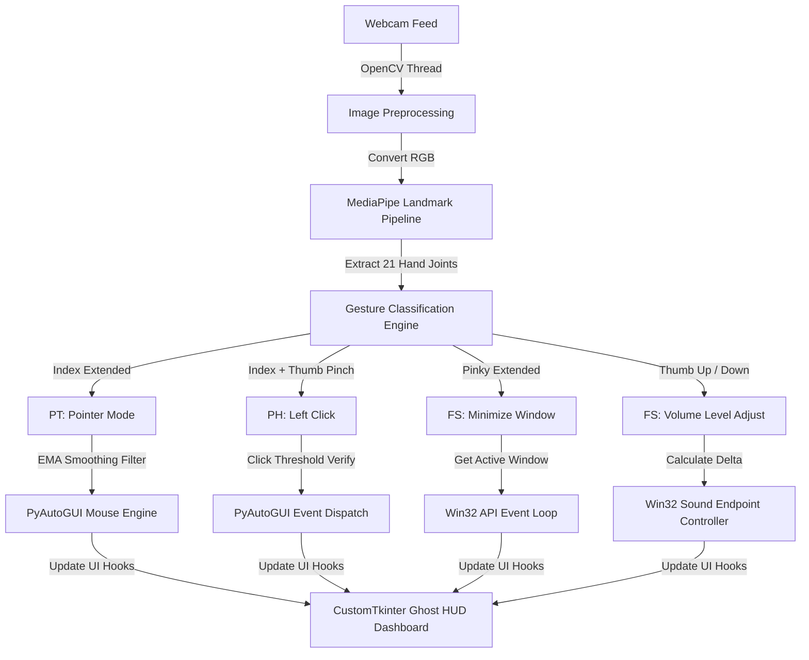

# 🖐️ Aether Hands v2.0

<p align="center">
  
  
  
  
  
</p>

**Aether Hands** is a native, high-performance gestural operating system controller. It leverages computer vision tracking to translate physical hand gestures in three-dimensional space into Windows OS instructions—including smooth cursor movement, left clicks, window minimization, and system volume level controls. All operations are displayed inside a sleek, cyberpunk-inspired semi-transparent **"Ghost HUD"** docked to the screen edge.

---

## ⚙️ Computer Vision Pipeline

The application splits computational loads across multiple threads: a high-frequency OpenCV capture frame thread, a MediaPipe Landmark extraction pipeline, and a CustomTkinter HUD interface loop. This ensures consistent 60fps tracking without UI blocking.



---

## 🚀 Key Features

* **Multi-Threaded Vision Engine:** Decouples OpenCV capture logic from the UI event loop, maintaining a sub-10ms processing latency.
* **Exponential Moving Average (EMA) Smoothing:** Implements coordinate dampening filters to eliminate standard webcam hand jitter, resulting in a smooth, high-precision desktop cursor experience.
* **Ghost HUD Sidebar Panel:** A native, semi-transparent CustomTkinter overlay that docks on the screen edge, showing active camera channels, real-time gesture feedback labels (`PT`, `PH`, `FS`), and visual coordinate feeds.
* **Dynamic Camera Selector:** Instantly switches between primary webcams and secondary external captures directly from the active HUD menu.
* **Direct Win32 API Integration:** Utilizes native Windows shell protocols (`win32gui`, `win32process`) to perform immediate, low-level OS operations like minimizing active windows or scaling audio registers.

---

## 🖐️ Gesture Classification Matrix

| Hand Gesture | Action Target | HUD Label | OS API Hook |
| :--- | :--- | :--- | :--- |
| **Pointer (Index Extended)** | Screen Cursor Movement | `PT` | `pyautogui.moveTo()` with EMA filter |
| **Pinch (Index + Thumb)** | Primary Left Mouse Click | `PH` | `pyautogui.click()` |
| **Pinky Up (Asymmetric)** | Minimize Foreground Window | `FS` | `win32gui.ShowWindow(hWnd, SW_MINIMIZE)` |
| **Thumb Up / Down** | Master Volume Scale | `FS` | `pywin32` Sound Endpoint controls |

---

## 📁 Repository Directory Structure

```text
├── native/
│   ├── main.py             # Vision processing, gesture logic, and Tkinter HUD
│   ├── requirements.txt    # Python library requirements list
│   └── tracker.py          # MediaPipe coordination and EMA smoothing modules
├── assets/                 # Custom graphic indicators and HUD icons
└── README.md               # User manual & tech overview
```

---

## 🛠️ Bootstrapping & Setup

### ⚙️ Prerequisites
* **OS:** Windows 10/11 (fully supports all native Win32 API capabilities)
* **Hardware:** Standard Web Camera
* **Python:** Version 3.9 or higher

### 🚀 Launching
1. **Clone the code:**
   ```bash
   git clone https://github.com/Stormynubee/aether-hands.git
   cd aether-hands
   ```

2. **Setup virtual sandbox and libraries:**
   ```bash
   # Create sandbox environment
   python -m venv venv
   source venv/Scripts/activate  # On Windows: venv\Scripts\activate
   
   # Acquire dependencies
   pip install -r native/requirements.txt
   ```

3. **Ignite the HUD:**
   ```bash
   python native/main.py
   ```

---
*Built with ❤️ by Stormynubee | Digital Reality Architect*
